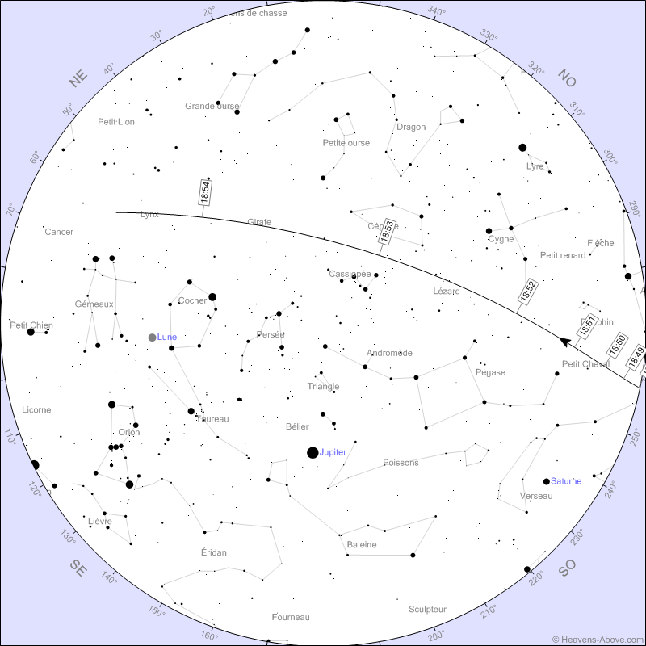

# SkyChart-360-Panorama

## Introduction

This script takes a sky chart and a 360° panorama of an horizon and merges the sky chart to the horizon. This allows to view the sky chart in the context of your panorama. Through a 360° image viewer, or by importing the image in Stellarium, you can then take a look at your sky chart with your phone with AR/VR.

I created this code to see the ISS path of a pass in my horizon and plan my observations. Thanks to it, I can precisely see where the ISS will appear and what path it will follow in the sky.

The images should follow a specific format :
* Horizon panorama : 
    - 360° azimuth on the width of the image, from -180° (left) to +180° (right), with North in the center (although this can be changed with the `az_range` argument in the `unfold_hemisphere` function)
    - 180° altitude on the height of the image, from -90° (bottom) to +90° (top), with horizon in the center
    - It can be created with the [360 Photo Sphere Camera](https://play.google.com/store/apps/details?id=com.foxpoi.panorama&hl=en_US) Android app
    - The sky must have been removed and made transparent (png image with transparence), with GIMP or Photoshop (or any other software)
* Sky chart :
    - Polar map with North on top, and azimuth rotating counterclockwise (looking at the sky : East on the left, West on the right)
    - Full 360° azimuth and 0°-90° altitude ranges
    - Sky charts generated by [Heavens-Above](https://heavens-above.com) follow this format
